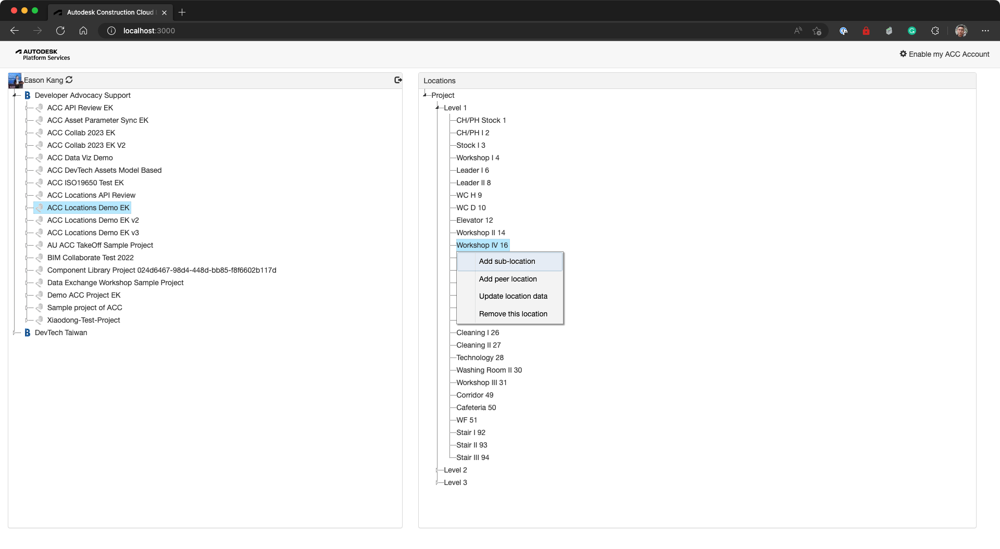

# ACC Locations Manager Sample


[](http://opensource.org/licenses/MIT)

[](http://forge.autodesk.com/)
[](http://forge.autodesk.com/)
[](https://forge.autodesk.com/en/docs/acc/v1/reference/http/locations-nodes-GET/)
[](https://forge.autodesk.com/en/docs/acc/v1/reference/http/index-v2-index-fields-get/)

[](http://developer.autodesk.com/)

# Description

This sample demonstrates the following use cases:

* View Locations tree (included sub-location nodes) similar to ACC Admin Locations UI.
* Add Locations node
  * Add sub-locations nodes
  * Add node before and after the target node. (in the same tree tier)
* Edit and delete Locations node.
* Import Locations (Levels & Rooms) from the selected Revit model via using [Model Properties API](https://forge.autodesk.com/en/docs/acc/v1/reference/http/index-v2-index-fields-get/)

This sample is implemented based on .NET Core version of [Learn Forge Tutorial](https://github.com/Autodesk-Forge/learn.forge.viewhubmodels/tree/netcore), please refer to https://learnforge.autodesk.io/ for the details about the framework.

## Thumbnail



## Demonstration

Here is the video demonstrating how this sample works quickly.

[]

# Web App Setup

## Prerequisites

1. **Forge Account**: Learn how to create a Forge Account, activate subscription and create an app at [this tutorial](http://learnforge.autodesk.io/#/account/). 
2. **ACC Account**: must be Account Admin to add the app integration. [Learn about provisioning](https://forge.autodesk.com/blog/bim-360-docs-provisioning-forge-apps).
3. **Visual Studio**: Either Community 2019+ (Windows) or Code (Windows, MacOS).
4. **.NET 6** basic knowledge with C#
5. **JavaScript** basic knowledge with **jQuery**

## Running locally

Clone this project or download it. It's recommended to install [GitHub desktop](https://desktop.github.com/). To clone it via command line, use the following (**Terminal** on MacOSX/Linux, **Git Shell** on Windows):

    git clone https://github.com/autodesk-forge/forge-acc.locations.manager

**Visual Studio** (Windows):

Right-click on the project, then go to **Debug**. Adjust the settings as shown below.

 

**Visual Studio Code** (Windows, MacOS):

Open the folder, at the bottom-right, select **Yes** and **Restore**. This restores the packages (e.g. Autodesk.Forge) and creates the launch.json file. See *Tips & Tricks* for .NET Core on MacOS.


At the `.vscode\launch.json`, find the env vars and add your Forge Client ID, Secret and callback URL. Also define the `ASPNETCORE_URLS` variable. The end result should be as shown below:

```json
"env": {
    "ASPNETCORE_ENVIRONMENT": "Development",
    "ASPNETCORE_URLS" : "http://localhost:3000",
    "FORGE_CLIENT_ID": "your id here",
    "FORGE_CLIENT_SECRET": "your secret here",
    "FORGE_CALLBACK_URL": "http://localhost:3000/api/forge/callback/oauth",
},
```

Run the app. Open `http://localhost:3000` to view your files. It may be required to **Enable my ACC Account** (see app top-right).

## Deployment

To deploy this application to Heroku, the **Callback URL** for Forge must use your `.herokuapp.com` address. After clicking on the button below, at the Heroku Create New App page, set your Client ID, Secret and Callback URL for Forge.

[](https://heroku.com/deploy?template=https://github.com/Autodesk-Forge/forge-acc.locations.manager)

Watch [this video](https://www.youtube.com/watch?v=Oqa9O20Gj0c) on how deploy samples to Heroku.

# Further Reading

Documentation:

- [Data Management API](https://forge.autodesk.com/en/docs/data/v2/overview/)
- [Locations API Field Guid](https://forge.autodesk.com/en/docs/acc/v1/overview/field-guide/locations/)
- [Locations API Reference](https://forge.autodesk.com/en/docs/acc/v1/reference/http/locations-nodes-GET/)

Tutorials:

- [Configure a Locations Tree](https://forge.autodesk.com/en/docs/acc/v1/tutorials/locations/)

Blogs:

- [Forge Blog](https://forge.autodesk.com/categories/bim-360-api)
- [Field of View](https://fieldofviewblog.wordpress.com/), a BIM focused blog

### Tips & Tricks

This sample uses .NET Core and works fine on both Windows and MacOS, see [this tutorial for MacOS](https://github.com/augustogoncalves/dotnetcoreheroku).

## License

This sample is licensed under the terms of the [MIT License](http://opensource.org/licenses/MIT). Please see the [LICENSE](LICENSE) file for full details.

## Change Log
- 09/03/2022: first release

## Written by

Eason Kang [@yiskang](https://twitter.com/yiskang), [Forge Partner Development](http://forge.autodesk.com)